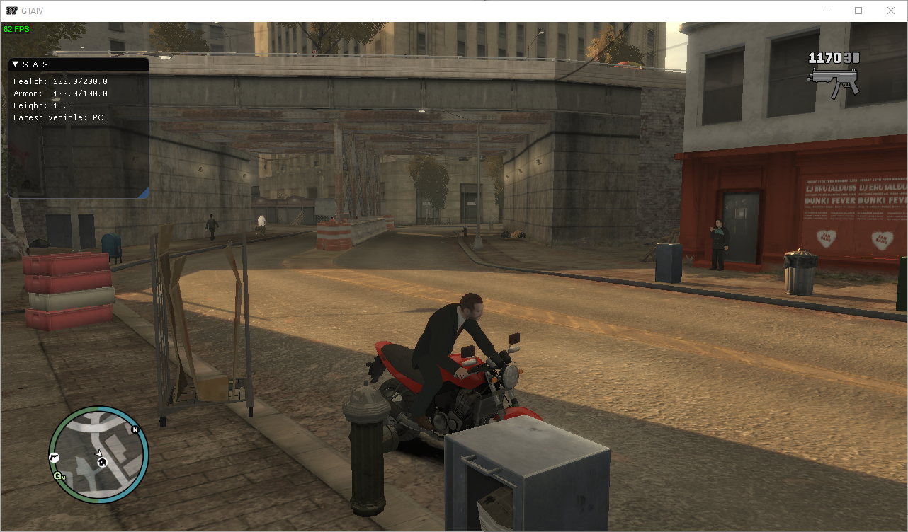

# d3d9-hooking-example



## What is (Direct3D9) hooking

Simply put hooking means directing code flow to your own code from somewhere
else. In the context of Direct3D this usually means executing your own code
whenever specific rendering functions are called.

Usually the reason to hook Direct3D is to render something on every frame. In
practice this means you'll want to render whatever you want before `Present`
is called. Usually hooking either `EndScene` or `Present` works well for this
purpose.

## How to hook Direct3D9

`d3d9-example-target` is an example application that implements basic render loop:

```c++
void render()
{
	g_pDevice->Clear(0, NULL, D3DCLEAR_TARGET, D3DCOLOR_XRGB(0, 40, 100), 1.0f, 0);
	g_pDevice->BeginScene();
	g_pDevice->EndScene();
	g_pDevice->Present(NULL, NULL, NULL, NULL);
}
```

To hook `EndScene` function we can do one of the following:

1. Patch the EndScene function to jump into our hook
2. Replace the EndScene function pointer in virtual method table to point at our hook
3. Replace the IDirect3DDevice9 object's virtual method table pointer to point at a
   new copy of the virtual method table containing our hook as the EndScene pointer.

Ignoring all the details schmetails the process could be as simple as this

```c++
auto pDevice = findDevicePointer();
originalEndScene = pDevice->vmt[offsetEndScene];
pDevice->vmt[offsetEndScene] = hookEndScene;
```

## Finding method offsets

* Find code that calls the desired method
  * The code will retrieve the object's virtual function table
  * The code will retrieve the desired method implementation from the table
* In this specific example we have the following offsets
  * 0x44 -> Present
  * 0xAC -> Clear
  * 0xA4 -> BeginScene
  * 0xA8 -> EndScene

## Finding the IDirect3DDevice9 object

## Reference

- http://www.directxtutorial.com/LessonList.aspx?listid=9